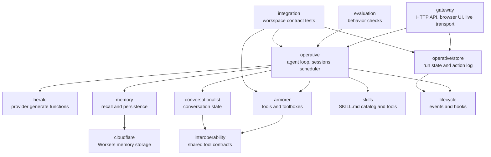

# Agent Bureau

Agent Bureau is a Bun-first monorepo for building, running, and operating agent systems. The workspace now ships both the low-level libraries and a gateway-first product surface: runtime composition, persistent sessions, live run streaming, scheduler administration, and a browser UI.

The packages are layered deliberately. Small shared contracts sit at the bottom, runtime packages compose those contracts into agent behavior, and `gateway` turns the runtime into an HTTP and browser product surface.

## What Ships

- **Runtime composition**: `gateway` and `createBureau()` assemble providers, fallover, routing, cache, guardrails, memory, identity, skills, and scheduler behavior from one configuration surface.
- **Session-first persistence**: gateway APIs and UI state use sessions as the canonical product concept, backed by `AgentSession` and `SessionStore`.
- **Live transport**: Bun WebSocket remains the fast path, and server-sent events provide Node-compatible live updates for run state and streaming deltas.
- **Operational controls**: the gateway exposes scheduler state, task submission, cancellation, recent history, managed API keys, and store-backed rate limiting.
- **Evaluation and utilities**: the workspace includes evaluation tooling, state tracking, Weft-backed durable key-value storage, vector search, and reusable lifecycle primitives.

## How the Packages Work Together

At a high level, Agent Bureau separates the agent loop from the provider, tool, memory, and product surfaces around it:



- **Shared contracts**: `interoperability` defines JSON-safe tool and embedding contracts, while `lifecycle` supplies typed events, observables, and hooks used across the runtime.
- **State and action layers**: `conversationalist` owns conversation history, `armorer` owns validated tools, and `operative/store` records run state and action history from live runs.
- **Runtime layer**: `operative` is the provider-agnostic agent loop. It takes a `GenerateFunction`, runs the conversation and tool cycle, emits lifecycle events, persists sessions, and coordinates scheduler and durable-run behavior.
- **Provider and knowledge layers**: `herald` adapts OpenAI, Anthropic, Gemini, and embedding providers into runtime functions; `memory` and `skills` add persistent recall and reusable procedural knowledge.
- **Product and platform layers**: `gateway` exposes the composed runtime through Hono routes, live transport, and Svelte UI pages. `cloudflare` supplies a Workers-ready memory storage backend.
- **Verification layers**: `evaluation` tests agent behavior, and `integration` verifies that the packages work together from consumer-style import paths and runtimes.

## Gateway-First Flow

The simplest way to use the workspace is to start with `createGateway()` and let it compose the runtime for you.

```ts
import { createGateway } from 'gateway';

const gateway = await createGateway({
  storage: { type: 'sqlite', path: 'agent-bureau.sqlite' },
  providers: [
    {
      name: 'fast',
      provider: { provider: 'openai', model: 'gpt-5.4-mini' },
    },
    {
      name: 'frontier',
      provider: { provider: 'anthropic', model: 'claude-sonnet-4.5' },
    },
  ],
  routing: {
    type: 'step-based',
    first: 'fast',
    middle: 'fast',
    last: 'frontier',
  },
  scheduler: { enabled: true },
});

const server = await gateway.start();
```

That composition path gives you:

- provider resolution with single-provider, fallover, or routing behavior
- persistent sessions through Weft's durable storage or an explicit key-value store
- memory recall and persistence hooks when memory is configured
- skill catalog injection and skill management tools when skills are configured
- live event delivery through WebSocket and server-sent events

If you need full control, `BureauOptions.generate` still acts as the advanced escape hatch.

Use an explicit SQLite path like the example above when you want sessions to survive process restarts. The `auto` storage mode is convenient for local experiments, but it can resolve to an in-memory store.

## Workspace Packages

Each workspace package has a package-level README with its local API, internal model, and project role.

| Package                                                     | Role                                                                                                                                                 |
| ----------------------------------------------------------- | ---------------------------------------------------------------------------------------------------------------------------------------------------- |
| [`armorer`](packages/armorer/README.md)                     | Validated tools, toolboxes, execution, provider adapters, MCP adapters, middleware, and test helpers.                                                |
| [`cloudflare`](packages/cloudflare/README.md)               | Cloudflare Workers memory storage backed by Durable Object SQLite plus Vectorize.                                                                    |
| [`conversationalist`](packages/conversationalist/README.md) | Immutable conversation state, runtime history management, provider message adapters, compaction, and serialization.                                  |
| [`evaluation`](packages/evaluation/README.md)               | Behavior evaluation suites, matchers, metrics, large language model judges, and report comparison.                                                   |
| [`gateway`](packages/gateway/README.md)                     | Hono HTTP gateway, browser UI, session APIs, live transport, scheduler routes, and runtime composition.                                              |
| [`herald`](packages/herald/README.md)                       | Provider factories, fallover, routing, streaming normalization, structured-output adapters, and embeddings.                                          |
| [`integration`](packages/integration/README.md)             | Cross-package validation for consumer imports, runtime compatibility, and package boundary behavior.                                                 |
| [`interoperability`](packages/interoperability/README.md)   | Shared JSON-safe tool-call, tool-result, embedding, and hashing contracts.                                                                           |
| [`lifecycle`](packages/lifecycle/README.md)                 | Typed event targets, async event iterators, observables, event forwarding, and hook registries.                                                      |
| [`memory`](packages/memory/README.md)                       | Memory storage contracts, embedding-backed recall, BM25 search, hybrid retrieval, hooks, identity, and memory tools.                                 |
| [`operative`](packages/operative/README.md)                 | Provider-agnostic agent loop, sessions, scheduler, durable runs, context assembly, guardrails, retry, streaming, and `operative/store` run tracking. |
| [`skills`](packages/skills/README.md)                       | `SKILL.md` parsing, skill providers, catalog injection, skill tools, storage, and proposal workflows.                                                |

Key-value persistence (sessions, identity, skills, proposals, rate-limit and API-key state) is backed by [Weft](https://www.npmjs.com/package/@lostgradient/weft)'s durable storage, consumed through its `textValueStore` surface.

## Quality Gates

Run these from the repository root:

```bash
bun run build
bun run test
bun run coverage:check
bun run integration
bun run validate
```

`bun run coverage:check` is the strict package-level coverage gate for the scoped public packages. `bun run validate` runs formatting, linting, type-checking, and tests through Turbo.

## Roadmap

The current release roadmap lives in [`ROADMAP.md`](ROADMAP.md). Deferred next-generation tracks are documented under [`reference/future/`](reference/future/).
