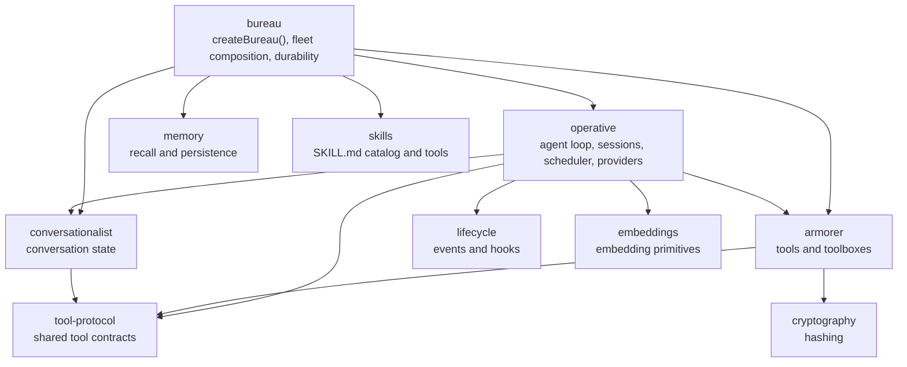

# Agent Bureau

> This repository is a **publication mirror** of the private corvidae workspace, which is its source of truth (Linear COR-1287, owner ruling of 2026-09-21). Pull requests are welcome, but they are ported into corvidae by hand and arrive back here through a sync — lint, tests, coverage and documentation audits all run in corvidae before a sync ever reaches this repository. The mirror's own CI is the transform-emitted `mirror-verify.yaml` plus `release.yml`, which publishes exactly as before.

Agent Bureau is a Bun-first monorepo for building, running, and operating agent systems. It ships the low-level libraries the agent loop is built from: tool registries, conversation state, memory, skills, and the runtime composition point that assembles them.

The packages are layered deliberately. Small shared contracts sit at the bottom, and runtime packages compose those contracts into agent behavior.

## What Ships

- **Runtime composition**: `createBureau()` assembles providers, fallover, routing, cache, guardrails, memory, identity, and skills behavior from one configuration surface.
- **Provider-agnostic agent loop**: `operative` runs the conversation and tool cycle, emits lifecycle events, persists sessions, and coordinates durable-run behavior against Anthropic, OpenAI, and Gemini.
- **Validated tools and conversation state**: `armorer` owns tool registries and execution, `conversationalist` owns immutable conversation history.
- **Knowledge layers**: `memory` and `skills` add persistent recall and reusable procedural knowledge.
- **Foundation contracts**: `lifecycle` supplies typed events, observables, and hooks; `tool-protocol`, `cryptography`, and `embeddings` supply the shared JSON-safe contracts, hashing, and embedding primitives the runtime packages build on.

## How the Packages Work Together

At a high level, Agent Bureau separates the agent loop from the provider, tool, and memory surfaces around it:


```mermaid
flowchart TD
  bureau["bureau\ncreateBureau(), fleet composition, durability"] --> operative["operative\nagent loop, sessions, scheduler, providers"]
  bureau --> armorer["armorer\ntools and toolboxes"]
  bureau --> conversationalist["conversationalist\nconversation state"]
  bureau --> memory["memory\nrecall and persistence"]
  bureau --> skills["skills\nSKILL.md catalog and tools"]
  operative --> armorer
  operative --> conversationalist
  operative --> tool-protocol["tool-protocol\nshared tool contracts"]
  operative --> lifecycle["lifecycle\nevents and hooks"]
  operative --> embeddings["embeddings\nembedding primitives"]
  armorer --> tool-protocol
  armorer --> cryptography["cryptography\nhashing"]
  conversationalist --> tool-protocol
```

- **Shared contracts**: `tool-protocol` defines JSON-safe tool and embedding contracts, while `lifecycle` supplies typed events, observables, and hooks used across the runtime.
- **State and action layers**: `conversationalist` owns conversation history, `armorer` owns validated tools, and `@lostgradient/operative/store` records run state and action history from live runs.
- **Runtime layer**: `operative` is the provider-agnostic agent loop. It takes a `GenerateFunction`, runs the conversation and tool cycle, emits lifecycle events, persists sessions, and coordinates scheduler and durable-run behavior. It also carries the provider factories (`@lostgradient/operative/anthropic`, `@lostgradient/operative/openai`, `@lostgradient/operative/gemini`, plus fallover, routing, streaming, and embeddings under `@lostgradient/operative/providers/*`) that adapt OpenAI, Anthropic, Gemini, and embedding providers into runtime functions.
- **Composition layer**: `bureau` is `createBureau()` — the fleet-level composition point. It assembles providers, tools, memory, skills, session persistence, durable execution (crash-and-resume runs and schedules), and multi-agent orchestration into one runtime, and exposes a typed `AgentDefinitions` catalog and an audit trail on top.
- **Knowledge layers**: `memory` and `skills` add persistent recall and reusable procedural knowledge.

## Composing a Bureau

```ts
import { createBureau } from 'bureau';

const bureau = await createBureau({
  agents: {},
  storage: { type: 'sqlite', path: 'agent-bureau.sqlite' },
  providers: [
    {
      name: 'fast',
      provider: { provider: 'openai', model: 'gpt-5.4-mini' },
    },
    {
      name: 'frontier',
      provider: { provider: 'anthropic', model: 'claude-sonnet-4.5' },
    },
  ],
  routing: {
    type: 'step-based',
    first: 'fast',
    middle: 'fast',
    last: 'frontier',
  },
});
```

That composition path gives you:

- provider resolution with single-provider, fallover, or routing behavior
- persistent sessions through Weft's durable storage or an explicit key-value store
- memory recall and persistence hooks when memory is configured
- skill catalog injection and skill management tools when skills are configured

If you need full control, `BureauOptions.generate` still acts as the advanced escape hatch.

Use an explicit SQLite path like the example above when you want sessions to survive process restarts. The `auto` storage mode is convenient for local experiments, but it can resolve to an in-memory store.

## Workspace Packages

Each workspace package has a package-level README with its local API, internal model, and project role.

| Package                                                      | Role                                                                                                                                                                                                                                                   |
| -------------------------------------------------------------| ------------------------------------------------------------------------------------------------------------------------------------------------------------------------------------------------------------------------------------------------------ |
| [`armorer`](packages/armorer/README.md)                      | Validated tools, toolboxes, execution, provider adapters, MCP adapters, middleware, and test helpers.                                                                                                                                                  |
| [`bureau`](packages/bureau/README.md)                        | `createBureau()` fleet composition: providers, tools, memory, skills, session persistence, durable execution and recovery, the typed `AgentDefinitions` catalog, and the durable audit trail.                                                          |
| [`conversationalist`](packages/conversationalist/README.md)  | Immutable conversation state, runtime history management, provider message adapters, compaction, and serialization.                                                                                                                                    |
| [`cryptography`](packages/cryptography/README.md)            | Hashing primitives shared by the runtime packages.                                                                                                                                                                                                      |
| [`embeddings`](packages/embeddings/README.md)                | Embedding primitives shared by the runtime packages.                                                                                                                                                                                                    |
| [`lifecycle`](packages/lifecycle/README.md)                  | Typed event targets, async event iterators, observables, event forwarding, and hook registries.                                                                                                                                                        |
| [`memory`](packages/memory/README.md)                        | Memory storage contracts, embedding-backed recall, BM25 search, hybrid retrieval, hooks, identity, and memory tools.                                                                                                                                   |
| [`operative`](packages/operative/README.md)                  | Provider-agnostic agent loop, sessions, scheduler, durable runs, context assembly, [guardrails](packages/operative/README.md#operativeguardrails--guardrails), retry, streaming, provider factories, and `@lostgradient/operative/store` run tracking. |
| [`skills`](packages/skills/README.md)                        | `SKILL.md` parsing, skill providers, catalog injection, skill tools, storage, and proposal workflows.                                                                                                                                                  |
| [`tool-protocol`](packages/tool-protocol/README.md)          | Shared JSON-safe tool-call, tool-result, and embedding contracts.                                                                                                                                                                                       |

Key-value persistence (sessions, identity, skills, proposals, rate-limit and API-key state) is backed by [Weft](https://www.npmjs.com/package/@lostgradient/weft)'s durable storage, consumed through its `textValueStore` surface.

## Quality Gates

Lint, tests, coverage, and documentation audits run in corvidae, not here. From the repository root:

```bash
bun run build
bun run check-types
```

`bun run check-package-shape` gates a package's shape (no foundation-package leaks, no undeclared externals) immediately before it publishes. Changesets (`bun run changeset`, `bun run check-changesets`, `bun run version`, `bun run release`) drive the release pipeline in [`RELEASING.md`](RELEASING.md).

## Roadmap

The current release roadmap, including genuinely deferred tracks, lives in [`ROADMAP.md`](ROADMAP.md).
